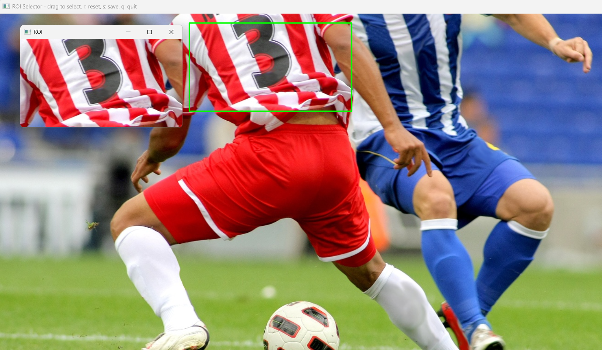

# OpenCV 실습 1주차 과제

컴퓨터비전 수업에서 OpenCV 라이브러리를 활용하여 이미지 처리와 마우스 이벤트를 이용한 인터랙티브 프로그램을 구현하였다.
각 실습은 이미지 처리의 기본 개념과 사용자 입력을 활용한 기능 구현을 목표로 한다.

---

## 1️⃣ 이미지 불러오기 및 그레이스케일 변환 (E01_1)

설명

이미지를 로드한 뒤 원본 컬러 영상과 그레이스케일 영상을 나란히 보여준다. 이미지 로드, 색상 변환, 배열 결합, 화면 표시의 기본 흐름을 학습한다.

주요 사용 함수 및 처리 흐름

- `cv.imread(path, cv.IMREAD_COLOR)` — 이미지 파일 로드
- `cv.cvtColor(img, cv.COLOR_BGR2GRAY)` — BGR → 그레이스케일 변환
- `cv.cvtColor(gray, cv.COLOR_GRAY2BGR)` — 그레이 이미지를 3채널로 복원(나란히 붙일 때 색상 채널 맞춤)
- `np.hstack((img, gray_display))` — 원본과 그레이 이미지를 가로로 결합
- `cv.resize(..., fx, fy)` — 표시용으로 축소(선택사항)
- `cv.imshow()` / `cv.waitKey()` — 화면 출력 및 키 입력 대기

실행

```powershell
cd Chapter_01
env\Scripts\python.exe E01_1.py
```


---

## 2️⃣ 페인팅 프로그램 (붓 크기 조절 기능, E01_2)

설명

마우스 드래그로 이미지를 그릴 수 있는 간단한 페인팅 도구이다. 좌/우 버튼으로 색을 선택하고 키보드 `+`/`-`로 브러시 크기를 조절한다.

주요 사용 함수 및 처리 흐름

- `cv.setMouseCallback(window, callback)` — 마우스 이벤트 등록
- 마우스 이벤트 핸들러에서 `cv.EVENT_LBUTTONDOWN/UP`, `cv.EVENT_RBUTTONDOWN/UP`, `cv.EVENT_MOUSEMOVE` 처리
- `cv.circle(img, (x,y), radius, color, -1)` — 현재 브러시 크기로 원을 채워 그림
- `cv.waitKey(1)` 루프에서 키 처리: `+`/`=` → 크기 증가, `-` → 크기 감소, `q` → 종료

주의: 브러시 크기는 1~15 범위로 제한되어 있다.

실행

```powershell
cd Chapter_01
env\Scripts\python.exe E01_2.py
```


---

## 3️⃣ 마우스 영역 선택 및 ROI 추출 (E01_3)

설명

사용자가 마우스로 이미지에서 사각형 영역을 드래그하면 그 영역을 ROI로 추출하여 별도 창에 표시하고, 필요시 파일로 저장할 수 있다.

주요 사용 함수 및 처리 흐름

- `cv.setMouseCallback(window, callback)` — 드래그 시작점/이동/종료 이벤트 처리
- 드래그 중에는 `cv.rectangle()`로 현재 선택 영역을 시각화
- ROI 추출: NumPy 슬라이싱 `roi = img[y1:y2, x1:x2].copy()`
- `cv.imshow("ROI", roi)`로 별도 창에 표시
- 키 처리: `r` → 리셋, `s` → 파일 저장, `q` → 종료

실행

```powershell
cd Chapter_01
env\Scripts\python.exe E01_3.py
```



---

## 공통 요구사항 및 환경

- Python 3.8 이상
- OpenCV 설치: `pip install opencv-python`
- NumPy 설치: `pip install numpy`
- 예제 이미지 `soccer.jpg` 및 각 미리보기 이미지는 `Chapter_01` 폴더에 위치함

필요하면 README에 실행 스크린샷을 더 추가하거나, 각 스크립트의 주요 코드 스니펫(핵심 콜백 함수 등)을 포함해 더 상세히 문서화해 드리겠습니다.


